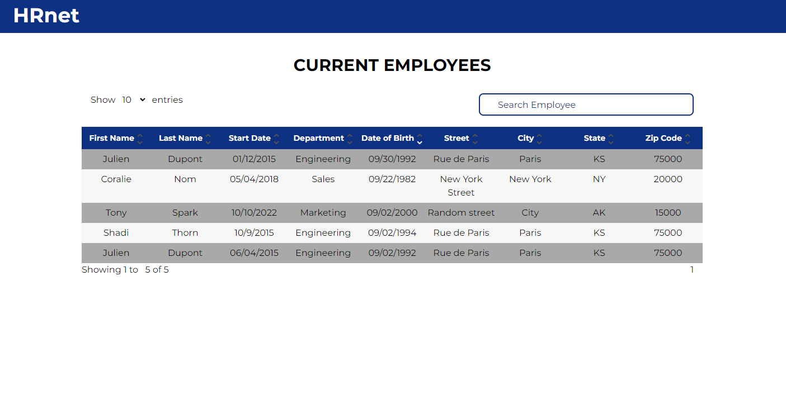

# HRnet

Some components might be currently too big but might be changed in the future into smaller ones.

## Goals

Update an old project using jQuery's plugin into React.
Four plugins had to be converted : 
- Modal      => Portal
- Lists      => Converted into plugin
- Table      => From Scratch
- DatePicker => Library used

## Technologies

- React
- Typescript
- Tailwind

## Plugin NPM

[Npm Link](https://www.npmjs.com/package/list-select)
[Npm github](https://github.com/SebastienStordeur/Hrnet-Plugin-List)